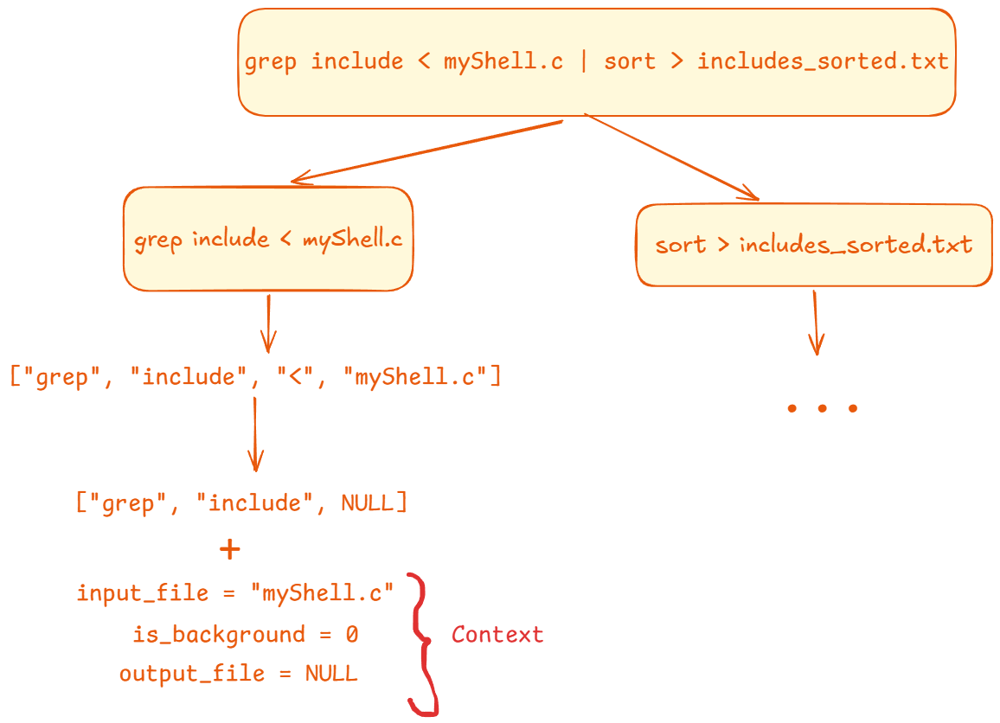

# Ours shell
The shell follows REPL (read, eval, print, loop), by using:
1. `while(1)`
2. Take input from user and parse commands.
3. execute the commands.
- builtin `cd` and `exit` using function `builtin_cd_exit`.
- builtin `pwd` and `history` using function `builtin_pwd_history`.
- other commands using `fork()` and `exec()` implemented in function `execute_single_command`
- if more than one command run `execute_pipeline`
4. return to setp 2.

#### Why we separated between `cd`, `exit` and `pwd`, `history` ?
They have different logic `cd` and `exit` can not have input/output redirections, but `pwd` and `history` have.

## Parsing commands


Parsing handles the cases such as `50&` and `50 &`. 

Note: when you need to write a string eg. `echo 'yahya'` remove `'` to be as `echo yahya`. this is our parsing logic to keep it simple.

## Built-in Commands
### cd
If there are no arguments other than `cd` (`arg[1] == NULL`), then `cd: at least one argument` is printed.

### exit
Nothing to mention here super easy

### pwd
`getcwd` => to get the current working directory.
`fflush`: to show output immediately to the screen.

### history
Loop through our list and print commands. Commands are added before execution.

## Foreground and background execution
This part is handled in two places:
1. In single process execution
2. In pipes

### single process execution
We `fork` the process, then if the written command is builtin we use it, if not we execute using `execvp`. The whole work are in parent part.

If the `is_background` is marked as `True`, we just print the `pid`, and stops the background process from writing to terminal.

### in pipes
If in the backgroun we print `pipeline running in background`.

## Input/Output Redirection
This is also handled in single process execution and pipes. We talked about how we parsed it. The remaining is only to open the files read or write standard input/output only, if file does not exits we create one using flag `O_CREAT`, if exits: remove its content using `O_TRUNC`.
Note that append is note implemented (not mentioned in the assignment) >> & <<

## Pipes
Each standard output of a process becomes the next input for the next process, commands are separated by `|` and parsed as mentioned. we handled how the first command will read the input, How the last command will write the output.

Also we put all process in a process group to control them easily and assigned the first process as the leader group.

## Signal Handling
We create a process group for non built in commands to separate between shell and the child process, so that ctrl+c can not stop the process (the same for pipes and first process is the leader group).

Ctrl+c => terminate foreground process only not the shell
Ctrl+z => suspend the process (not killed so you can see in the `ps`).

## Error Handling
We ensured to print messages for mostly every case in the code to make our shell roboust and reliable.

We also tested through various test cases which include edge cases as well.

### Test cases
#### Build in commands without fork() nor exec()
##### single direct command
```bash
$ exit
yahya@Yahia-Mahmoud:/mnt/d/University/Third Year/Second semester/OS/project/project$ 
```
```bash
$ cd ../ # step back
$ cd project # step forward
$ cd gg # non existing dir
cd: No such file or directory
$ cd # without any arguments
cd: at least one argument
```
```bash
$ history
1  ls
2  cd ../
3  cd project
4  cd gg
5  cd
6  history
```
Note: `history` adds the command to the history before execution, includes also commands that revealed an error (as it is added before execution we do not know if it will produce an error).
```bash
$ pwd
/mnt/d/University/Third Year/Second semester/OS/project/project
```
##### pwd and history with input/output redirections
`pwd` and `history` can have input/output redirections, but `cd` and `exit` do not.
```bash
$ pwd > pwd.txt

# Show if the content is added correctly to the file
$ cat pwd.txt
/mnt/d/University/Third Year/Second semester/OS/project/project
```
```bash
$ history > hist.txt

# Show if the content is added correctly to the file
$ cat < hist.txt
1  ls
2  cd ../
3  cd project
4  cd gg
5  cd
6  history
7  pwd
8  clear
9  pwd > pwd.txt
10  cat pwd.txt
11  cat < pwd.txt
12  history > hist.txt
```

#### Other commands with fork() nor exec()
##### single command
```bash
$ ls -la
total 3944
drwxrwxrwx 1 yahya yahya    4096 Apr 17 09:18  .
drwxrwxrwx 1 yahya yahya    4096 Apr 17 06:44  ..
drwxrwxrwx 1 yahya yahya    4096 Apr 17 08:57  .vscode
-rwxrwxrwx 1 yahya yahya 4037806 Apr 17 06:44 'OS - Final Project.pdf'
drwxrwxrwx 1 yahya yahya    4096 Apr 17 08:49  codecrafters-shell-c
drwxrwxrwx 1 yahya yahya    4096 Apr 19 08:29  project
```

##### with input/output redirections
```bash
$ ls -la > ls.txt # output redirection
$ cat < ls.txt # input redirection
total 3944
drwxrwxrwx 1 yahya yahya    4096 Apr 19 08:34 .
drwxrwxrwx 1 yahya yahya    4096 Apr 17 06:44 ..
drwxrwxrwx 1 yahya yahya    4096 Apr 17 08:57 .vscode
-rwxrwxrwx 1 yahya yahya 4037806 Apr 17 06:44 OS - Final Project.pdf
drwxrwxrwx 1 yahya yahya    4096 Apr 17 08:49 codecrafters-shell-c
-rwxrwxrwx 1 yahya yahya       0 Apr 19 08:34 ls.txt
drwxrwxrwx 1 yahya yahya    4096 Apr 19 08:29 project
```

#### foreground/background execution
Note: It is unlogical to have background execution for `exit` and `cd`.
```bash
$ sleep 5 &
[PID 2564]
$ pwd &
[PID 2567]
$ /mnt/d/University/Third Year/Second semester/OS/project
```

#### Pipes
##### Two stage
```bash
$ cat /etc/passwd | grep root
root:x:0:0:root:/root:/bin/bash
```
##### Multi stage
```bash
$ ls | grep \.c$      
builtin.c
myShell.c
unbuiltin_command.c
```
Note that: our shell does not require `''`, should be avoided.
##### With built in
```bash
$ history | grep ls
1  ls | grep '\.c$'
2  ls | grep \.c$
3  history | grep ls
```
Note: It not logicall to hold `exit` or `cd` in pipes, as each command in the pipe are forked then executed separately, so if `exit` called it will end the process itself not the pipe as a whole, if `cd` is called then this will change the directory on the forked process not in the parent process, so no effect at all, you will be on the same position.

#### long data pipeline
```bash
$ cat Makefile | grep . | sort | uniq
        gcc myShell.c builtin.c
        rm -f sysinfo
all:
clean:
```

#### redirection with pipes
##### input + pipe
```bash
grep main < myShell.c | wc -l
1
```

##### output + pipe
```bash
$ ls | grep \.h$ > headers.txt
$ cat headers.txt
Command.h
ExecutionContext.h
builtin.h
```

##### Input + output + pipe
```bash
$ grep include < myShell.c | sort > includes_sorted.txt
$ cat includes_sorted.txt
#include "ExecutionContext.h"
#include "builtin.h"
#include <fcntl.h>
#include <signal.h>
#include <stdbool.h>
#include <stdio.h>
#include <stdlib.h>
#include <string.h>
#include <sys/types.h>
#include <sys/wait.h>
#include <unistd.h>
```

#### Edge cases
Should be in the same directory (as `cd` affected the sub process of the pipe not the parent shell)
```bash
$ ls
'OS - Final Project.pdf'   codecrafters-shell-c   ls.txt   project
$ cd .. | ls
'OS - Final Project.pdf'   codecrafters-shell-c   ls.txt   project
```

Should not exit the shell, (exit in the sub process of the pipe)
```bash
$ exit | pwd
/mnt/d/University/Third Year/Second semester/OS/project
$ # our shell is not terminated
```

### Signal handling
```bash
$ sleep 10 | sleep 10 | sleep 10
^C$ # The foreground ends not the shell
```
ctrl+c stopped the foreground only but the shell still working (pipe case)

```bash
$ sleep 1000
^C$ 
```
ctrl+c stopped the foreground only but the shell still working(single command case)

### Background with pipes
```bash
$ sleep 10 | sleep 10 | sleep 10 &
[pipeline running in background]
$ 
```

```bash
$ sleep 100
^Z
[560]  + Stopped (signal 20)  sleep
$ ps -cf
UID          PID    PPID CLS PRI STIME TTY          TIME CMD
yahya        403     399 TS   19 06:45 pts/2    00:00:00 -bash
yahya        446     403 TS   19 06:47 pts/2    00:00:00 /bin/bash ./tests.sh
yahya        523     446 TS   19 06:47 pts/2    00:00:00 [myShell] <defunct>
yahya        542     403 TS   19 06:48 pts/2    00:00:00 ./myShell
yahya        555     542 TS   19 06:48 pts/2    00:00:00 [sleep] <defunct>
yahya        556     542 TS   19 06:48 pts/2    00:00:00 [sleep] <defunct>
yahya        557     542 TS   19 06:48 pts/2    00:00:00 [sleep] <defunct>
yahya        560     542 TS   19 06:49 pts/2    00:00:00 sleep 100
yahya        561     542 TS   19 06:50 pts/2    00:00:00 ps -cf 
```
process `560` moved successfully from foreground to the background when pressed ctrl+z

```bash
$ sleep 100 | sleep 100 | sleep 100
^Z
[666]  + Stopped (signal 20)

[667]  + Stopped (signal 20)

[668]  + Stopped (signal 20)
$ ps -cf
UID          PID    PPID CLS PRI STIME TTY          TIME CMD
yahya        286     285 TS   19 06:59 pts/0    00:00:00 -bash
yahya        487     286 TS   19 07:00 pts/0    00:00:00 /bin/bash ./tests.sh
yahya        564     487 TS   19 07:00 pts/0    00:00:00 [myShell] <defunct>
yahya        572     286 TS   19 07:01 pts/0    00:00:00 /bin/bash ./tests.sh
yahya        649     572 TS   19 07:01 pts/0    00:00:00 [myShell] <defunct>
yahya        656     286 TS   19 07:02 pts/0    00:00:00 ./myShell
yahya        666     656 TS   19 07:02 pts/0    00:00:00 sleep 100
yahya        667     656 TS   19 07:02 pts/0    00:00:00 sleep 100
yahya        668     656 TS   19 07:02 pts/0    00:00:00 sleep 100
yahya        670     656 TS   19 07:02 pts/0    00:00:00 ps -cf
```
Notice: processes `666`, `667`, and `668` are running successfully in the background, when pressed ctrl+z, all processes of the pipe moved from foreground to the background.

